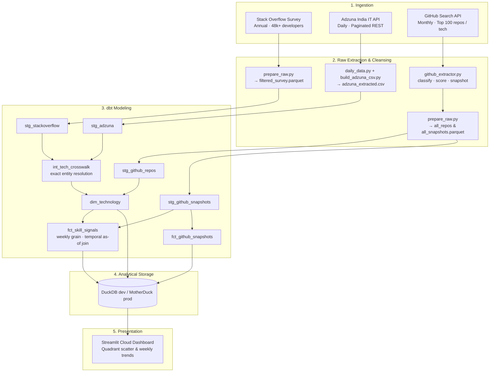

# Labor Market Intelligence

> **Which technology skills are rising in real employer hiring demand vs. developer ecosystem hype?**

An end-to-end analytics engineering pipeline combining **Stack Overflow Developer Survey** (adoption baseline), **Adzuna India IT** (employer demand), and **GitHub Search API** (open-source ecosystem momentum) to detect skill divergence before it appears in conventional industry reports.

---

## Live Dashboard

🔗 **[Launch Interactive Dashboard (Streamlit Cloud)](https://gwdfj7h57dt7dfwh3itgpy.streamlit.app/)**

---

## Analytical Mission: The Signal Matrix

By cross-referencing weekly employer demand against GitHub open-source breadth and activity, technologies are categorized into four quadrants (`fct_skill_signals.composite_signal`):

| Quadrant | Condition | Definition | Archetype |
|---|---|---|---|
| **Thriving** | Jobs $\ge$ 5 & Repos $\ge$ 30 | High hiring demand backed by vibrant open-source momentum | Python, React, Docker |
| **Demand-Led** | Jobs $\ge$ 5 & Repos < 30 | Strong hiring demand despite quiet open-source hype | SQL Server, Spring Boot, Java Enterprise |
| **Hype-Led** | Jobs < 5 & Repos $\ge$ 30 | Heavy developer attention & tutorials with low employer hiring | Experimental AI agents, nascent frameworks |
| **Weak / Niche**| Jobs < 5 & Repos < 30 | Low commercial demand and low community activity | Legacy tools, niche DSLs |

---

## Architecture



---

## Tech Stack & Rationale

| Layer | Technology | Decision Rationale |
|---|---|---|
| **Storage & Warehouse** | **DuckDB / MotherDuck** | Embedded columnar OLAP locally for fast dbt iterations; MotherDuck serverless cloud warehouse for dashboard production serving without infrastructure overhead. |
| **Transformation** | **dbt (dbt-duckdb)** | SQL-first modeling with lineage, schema constraints, and singular tests (`assert_crosswalk_resolves_known_techs`, `assert_composite_signal_consistent`). |
| **Orchestration** | **GitHub Actions + Dagster** | GitHub Actions runs daily production cron (`02:00 IST`) pushing to MotherDuck; Dagster provides software-defined asset graphs for local orchestrations. |
| **Presentation** | **Streamlit + Plotly** | Interactive analytical dashboard with live queries, week-over-week deltas, and snapshot freshness indicators. |

---

## Repository Structure

```
Labor-Market-Intelligence/
├── raw/
│   ├── adzuna/                 # Daily paginated REST fetcher & regex extractor
│   ├── github/                 # Top-100 extractor, rule-based classifier & snapshot metrics
│   ├── stackoverflow/          # Survey ingestion & column filtering
│   ├── prepare_raw.py          # Parquet consolidation for dbt sources
│   ├── tech_dimension_table.json # Pre-validated crosswalk (SO name ↔ GitHub slug ↔ Adzuna keyword)
│   └── emerging_tech.json      # Crosswalk extensions for modern AI/ML frameworks
├── dbt/
│   ├── models/
│   │   ├── staging/            # Source unnesting, typing, and standard views
│   │   ├── intermediate/       # int_tech_crosswalk (exact entity resolution)
│   │   └── marts/              # dim_technology, fct_skill_signals, fct_github_snapshots
│   ├── tests/                  # Singular business logic & consistency tests
│   └── profiles.yml            # DuckDB (dev) / MotherDuck (prod) targets
├── dagster/
│   ├── assets/                 # Software-defined assets (raw_assets.py, dbt_assets.py)
│   └── definitions.py          # Schedules, jobs, and dbt CLI resource
├── dashboard/
│   └── app.py                  # Streamlit application (queries DuckDB / MotherDuck)
├── scripts/
│   ├── sync_warehouse_cache.py # Pre-check MotherDuck to restore snapshots without hitting API limits
│   ├── ci_stub_data.py         # Schema-compatible test stubs for automated CI
│   └── create_md_db.py         # MotherDuck database initialization script
└── .github/workflows/
    ├── production_pipeline.yml # Scheduled daily extraction & MotherDuck push
    └── dbt_ci.yml              # Automated dbt build and testing on push/PR
```

---

## Quickstart (Local Development)

### 1. Prerequisites & Environment
```bash
# Clone and enter project directory
git clone https://github.com/HarshM-Workspace/Harsh_Mishra_Projects.git
cd Harsh_Mishra_Projects/Labor-Market-Intelligence

# Create virtual environment & install requirements
python -m venv .venv
source .venv/bin/activate  # Windows: .venv\Scripts\activate
pip install -r requirements.txt

# Configure environment variables
cp .env.example .env
```

### 2. Extract & Consolidate Raw Data
```bash
# Extract raw data
python raw/adzuna/build_adzuna_csv.py
python raw/github/github_extractor.py

# Consolidate raw files into DuckDB-ready Parquet
python raw/prepare_raw.py
```

### 3. Build dbt Models & Run Tests
```bash
cd dbt
dbt deps
dbt build --target dev
cd ..
```

### 4. Launch Dashboard
```bash
streamlit run dashboard/app.py
```

---

## Pipeline Safeguards & Design Principles

- **Exact Entity Resolution**: Controlled crosswalk lookup (`tech_dimension_table.json`) avoids false-positive fuzziness; unresolved technologies are explicitly flagged with `is_unresolved = true` rather than silently dropped.
- **Strict Rate-Limit & Idempotency**: GitHub extractor skips already-persisted snapshots and dynamically sleeps based on `X-RateLimit-Remaining` headers.
- **Negative Lookaround Keyword Matching**: Adzuna extractor uses regex lookarounds (`(?<![A-Z0-9])TECH(?![A-Z0-9])`) to avoid substring false matches (e.g., `R` matching `REACT` or `C` matching `CSS`).
- **Warehouse Cache Sync**: `sync_warehouse_cache.py` inspects MotherDuck before running GitHub extractions, allowing environments to hydrate from cloud cache without exhausting API quotas.

---

## Known Boundaries & Tradeoffs

- **Geographic Scope**: Adzuna job postings target India IT requisitions; not representative of global enterprise hiring.
- **GitHub Attention vs. Enterprise Reality**: GitHub stars measure open-source community interest and tooling experiments; proprietary enterprise mainstays (e.g., SQL Server, SAP) naturally show low GitHub footprint.
- **Snapshot Frequency**: GitHub metrics capture periodic monthly snapshots; trend deltas populate as successive monthly snapshots accumulate.
