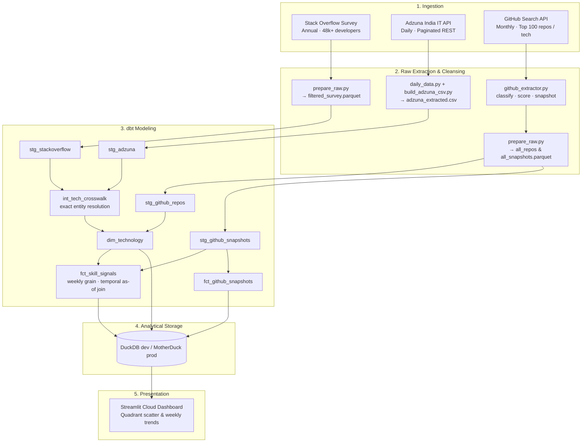

# Labor Market Intelligence

> **Which technology skills are rising in real employer hiring demand vs. developer ecosystem hype?**

An end-to-end analytics engineering pipeline combining **Stack Overflow Developer Survey** (adoption baseline), **Adzuna India IT** (employer demand), and **GitHub Search API** (open-source ecosystem momentum) to detect skill divergence before it appears in conventional industry reports.

---

## Live Dashboard

🔗 **[Launch Interactive Dashboard (Streamlit Cloud)](https://gwdfj7h57dt7dfwh3itgpy.streamlit.app/)**

---

## Analytical Mission: The Signal Matrix

By cross-referencing weekly employer demand against GitHub open-source breadth and activity, technologies are categorized into four quadrants (`fct_skill_signals.composite_signal`):

| Quadrant | Condition | Definition | Archetype |
|---|---|---|---|
| **Thriving** | Jobs $\ge$ 5 & Repos $\ge$ 30 | High hiring demand backed by vibrant open-source momentum | Python, React, Docker |
| **Demand-Led** | Jobs $\ge$ 5 & Repos < 30 | Strong hiring demand despite quiet open-source hype | SQL Server, Spring Boot, Java Enterprise |
| **Hype-Led** | Jobs < 5 & Repos $\ge$ 30 | Heavy developer attention & tutorials with low employer hiring | Experimental AI agents, nascent frameworks |
| **Weak / Niche**| Jobs < 5 & Repos < 30 | Low commercial demand and low community activity | Legacy tools, niche DSLs |

---

## Architecture



---

## Tech Stack & Rationale

| Layer | Technology | Decision Rationale |
|---|---|---|
| **Storage & Warehouse** | **DuckDB / MotherDuck** | Embedded columnar OLAP locally for fast dbt iterations; MotherDuck serverless cloud warehouse for dashboard production serving without infrastructure overhead. |
| **Transformation** | **dbt (dbt-duckdb)** | SQL-first modeling with lineage, schema constraints, and singular tests (`assert_crosswalk_resolves_known_techs`, `assert_composite_signal_consistent`). |
| **Orchestration** | **GitHub Actions + Dagster** | GitHub Actions runs daily production cron (`02:00 IST`) pushing to MotherDuck; Dagster provides software-defined asset graphs for local orchestrations. |
| **Presentation** | **Streamlit + Plotly** | Interactive analytical dashboard with live queries, week-over-week deltas, and snapshot freshness indicators. |

---

## Repository Structure

```
Harsh_Mishra_Projects/
├── .github/workflows/
│   ├── production_pipeline.yml # Scheduled daily extraction & MotherDuck push
│   └── dbt_ci.yml              # Automated dbt build and testing on push/PR
└── Labor-Market-Intelligence/
    ├── raw/                    # Extraction scripts & tech crosswalk mappings
    ├── dbt/                    # dbt project (staging, intermediate, marts & tests)
    ├── dagster/                # Orchestration assets and definitions
    ├── dashboard/              # Streamlit dashboard application
    ├── scripts/                # Warehouse cache sync, CI stubs & setup scripts
    └── README.md               # Detailed project documentation
```

---

## Quickstart (Local Development)

```bash
# 1. Clone repo & navigate to project
git clone https://github.com/Tw1-Light/Harsh_Mishra_Projects.git
cd Harsh_Mishra_Projects/Labor-Market-Intelligence

# 2. Environment setup
python -m venv .venv
source .venv/bin/activate  # Windows: .venv\Scripts\activate
pip install -r requirements.txt
cp .env.example .env

# 3. Ingestion & Transformation
python raw/adzuna/build_adzuna_csv.py
python raw/github/github_extractor.py
python raw/prepare_raw.py
dbt build --project-dir dbt --profiles-dir dbt

# 4. Run Dashboard
streamlit run dashboard/app.py
```

For full architecture details and design notes, refer to the [Labor-Market-Intelligence README](file:///Labor-Market-Intelligence/README.md).